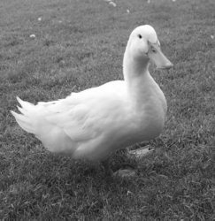

# Grey map and assembler

 

## Description

A picture in the form of a pixel matrix is given. The color of each pixel is stored as 24 bits, 8 bits for each color (RGB). Write the procedure in Assembler which will convert the image into a grayscale using the weighted average.

Because the human eyes differently react to the colors, the coefficients for individual components cannot be the same, it is usually assumed:
 - `77` for red
 - `151` for green
 - `28` for blue

The coefficients sum up to 256.

The arguments of the procedure:
 - address to the matrix
 - matrix sizes: number of rows and columns.

It would be nice to be able to change the value of the color coefficients from the main program.

## Additionally

Write the main program (in C) which will load the PPM file and convert it to the appropriate matrix (you can use a library, as long as it does not contain errors ;-)). Then, you should trigger asm procedure. The resulting matrix should be converted back to a PGM file.

